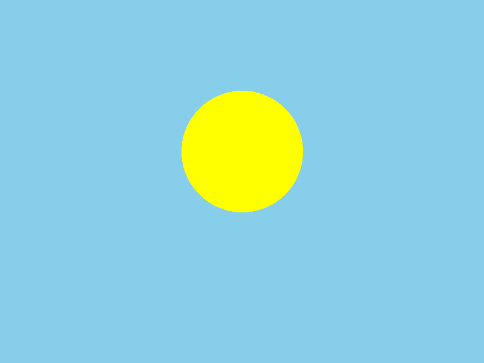
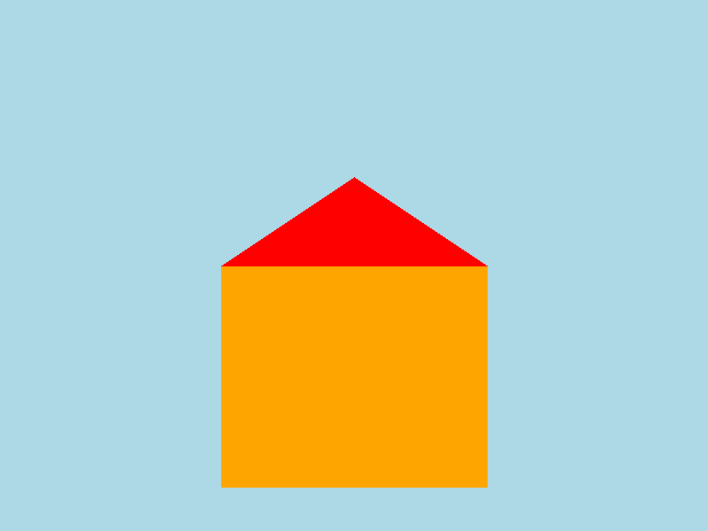
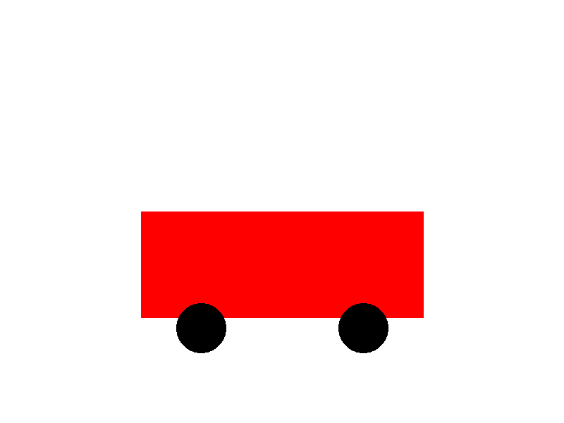
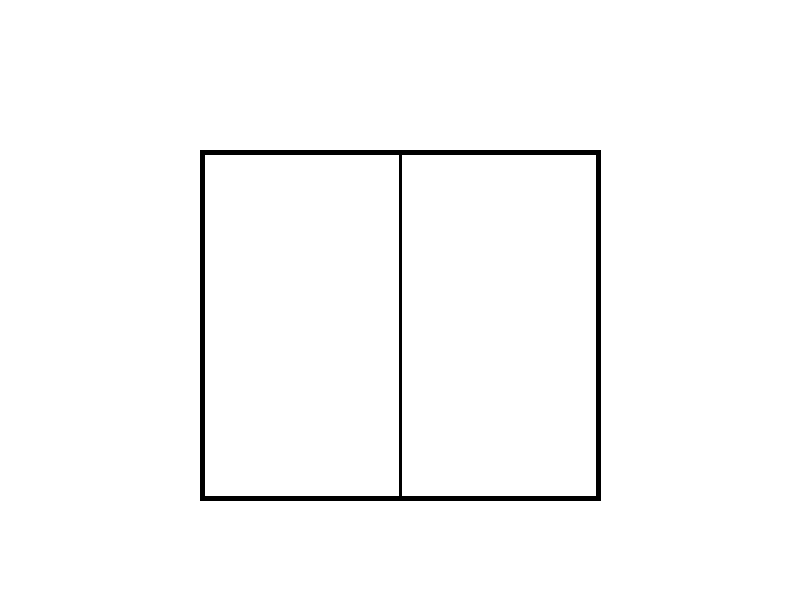
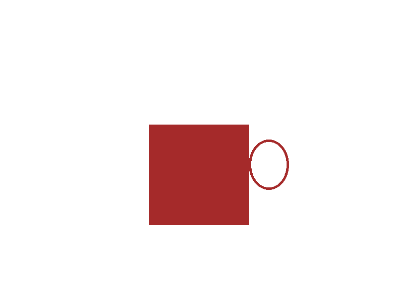
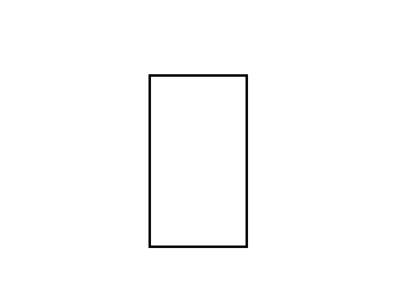
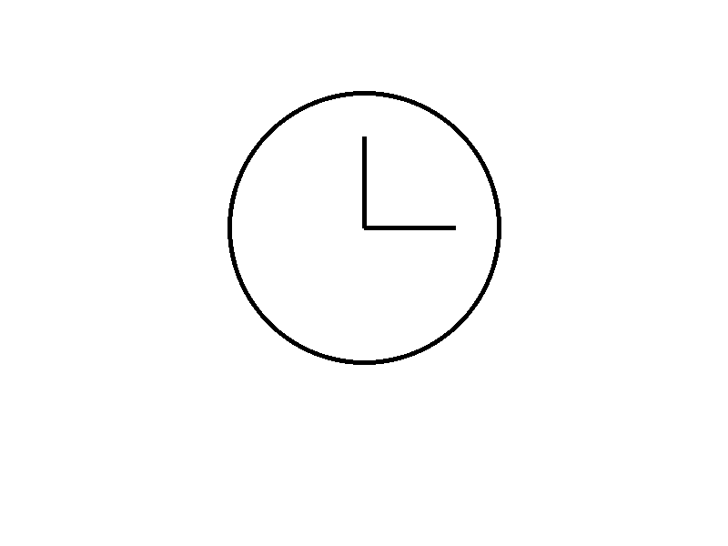

# Meaningful Images Summary

Source document: `meaningful_images.docx`

## Image 1

This image depicts a bright yellow sun centered in a clear blue sky.

## Image 2

This image shows a simple tree with a dark green round canopy and a brown trunk on a light green background.

## Image 3

This image illustrates a basic house shape with an orange square body and a red triangular roof.

## Image 4

This image presents a gray triangular mountain against a blue background.

## Image 5

This image shows a wide blue horizontal band running across a light green background like a river or road.

## Image 6

This image depicts a simple red car-like shape with two black wheels on a white background.

## Image 7

This image shows a rectangular window or double-panel frame outlined in black.

## Image 8

This image depicts a red mug with a circular handle on its right side.

## Image 9

This image shows a tall upright rectangle outlined in black like a door or standing panel.

## Image 10

This image depicts a simple analog clock face with hands pointing to about 3:00.
